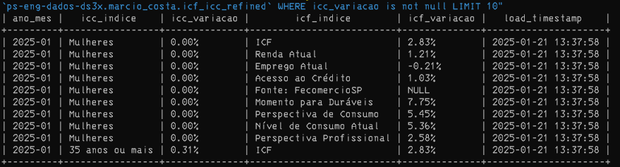

# README - Data Processing Pipeline

## Descrição do Projeto
Este projeto implementa um pipeline de processamento de dados que:
1. Faz o download de arquivos XLS usando Selenium.
2. Converte os arquivos XLS para CSV.
3. Carrega os dados no BigQuery em tabelas brutas.
4. Realiza transformações SQL para criar tabelas refinadas e confiáveis.

O pipeline é configurado para funcionar localmente ou em um ambiente Docker.

---

## Como Executar o Pipeline

### Requisitos
- **Docker** instalado na máquina.
- **Credenciais do Google Cloud** para acesso ao BigQuery.

### Clonar o Repositório
1. **Faça o clone do repositório**:
   ```bash
   git clone https://github.com/m4r6i0/ds3x-test.git
   cd ds3x-test
   ```

### Passos para Execução com Docker
1. **Criar a Imagem Docker**:
   ```bash
   docker build -t python-selenium-app .
   ```

2. **Executar o Container**:
   Use o seguinte comando para rodar o pipeline diretamente com o Docker:
   ```bash
   docker run --rm -it \
       -v C:\temp\ds3x\auth:/app/auth \
       -e GCP_SERVICE_ACCOUNT=/app/auth/SA-marcio_costa.json \
       python-selenium-app
   ```

---

## Regras Aplicadas nas Tabelas

### Tabelas Trusted (`icc_trusted` e `icf_trusted`)
- Dados organizados, sem duplicatas.
- Colunas renomeadas para facilitar entendimento e consistência.

#### Exemplos de Regras:
- `indice` é normalizado como `icc_indice`.
- `variação (%)` é renomeado para `icc_variacao`.

### Tabela Refinada (`icf_icc_refined`)
- Combinação de dados de `icc_trusted` e `icf_trusted` com base em `ano_mes`.
- Colunas:
  - `ano_mes`: chave temporal comum (formato `YYYY-MM`).
  - Métricas do ICC: `icc_indice`, `icc_variacao`.
  - Métricas do ICF: `icf_indice`, `icf_variacao`.
  - `load_timestamp`: registro de data/hora da criação da tabela.

---

## Decisões Técnicas
- **Selenium com WebDriver Manager**: Facilita a gestão do driver do Chrome.
- **Pandas**: Utilizado para manipulação de dados e conversão de XLS para CSV.
- **BigQuery**:
  - Armazenamento e transformação dos dados.
  - Queries SQL organizadas em arquivos para modularidade e manutenção.
- **`.env` para Configuração**:
  - Facilita a parametrização de variáveis sensíveis e caminhos dinâmicos.

---

## Validação no BigQuery
Após executar o pipeline, você pode verificar os resultados no BigQuery com a seguinte query:

```bash
bq query --use_legacy_sql=false \
"SELECT DISTINCT * FROM `ps-eng-dados-ds3x.marcio_costa.icf_icc_refined` WHERE icc_variacao IS NOT NULL LIMIT 10"
```

### Resultado da Query
Abaixo está um exemplo de resultado obtido ao executar a query acima:



---

## Estrutura do Repositório
```plaintext
.
├── img/                      # Envidencias de testes
├── data/                     # Arquivos CSV gerados
├── src/
│   ├── crawler/              # Scripts para download de arquivos
│   ├── transformations/      # Scripts de transformação e queries SQL
│   └── utils/                # Funções utilitárias (ex.: logger)
├── Dockerfile                # Configuração do Docker
├── main.py                   # Script principal
├── requirements.txt          # Dependências do projeto
└── .env                      # Configurações de ambiente
```
